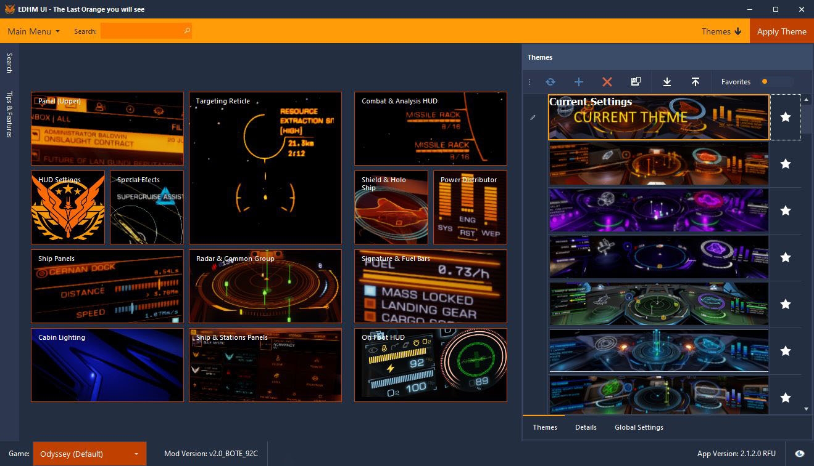

# EDHM_UI

User Interface for Elite Dangerous HUD Mod (EDHM)

## What is EDHM_UI?

EDHM_UI is the user interface for the Elite Dangerous mod [EDHM](https://github.com/psychicEgg/EDHM) by @psychicEgg.

Current features include:

* Allowing the user to change all of the mods current options using a simple graphical interface.
* Bundled with the latest EDHM version - no need to install EDHM separately.
* Bundled with lots of pre-made, community-contributed themes.
* Fully compatible with both Horizons and Odyssey!

## Requirements

EDHM_UI requires Microsoft .NET Framework version 4.52 or newer. If you are on Windows
10, you may already have it. If you don't have it installed yet, you can get it [here](https://dotnet.microsoft.com/download/dotnet-framework/net452).

## Installing EDHM_UI

* Download the latest release from the [releases page](https://github.com/BlueMystical/EDHM_UI/releases).
* Run the installer.
  * NOTE: It is recommended to install EDHM_UI in the default location to avoid possible permissions issues.
* Double-click on the EDHM_UI desktop icon.
* Profit!

## Initial setup

The first time EDHM_UI runs, it will prompt you for the Elite Dangerous game folder.
This determines where the EDHM core mod will be installed. The location varies depending
on which version of ED you have installed. The following indicate the default locations
used by ED for various services.

| Service        | Game Version | Install Path                                                                                         |
|----------------|--------------|------------------------------------------------------------------------------------------------------|
| **Steam**      |              |                                                                                                      |
|                | Horizons     | `C:\Program Files (x86)\Steam\steamapps\common\Elite Dangerous\Products\elite-dangerous-64\`         |
|                | Odyssey      | `C:\Program Files (x86)\Steam\steamapps\common\Elite Dangerous\Products\elite-dangerous-odyssey-64\` |
|                | Odyssey      | `C:\Program Files (x86)\Steam\steamapps\common\Elite Dangerous\Products\FORC-FDEV-DO-1000\`          |
| **Epic**       |              |                                                                                                      |
|                | Horizons     | `C:\Program Files\Epic Games\EliteDangerous\Products\elitedangerous-64\`                             |
|                | Odyssey      | `C:\Program Files\Epic Games\EliteDangerous\Products\elite-dangerous-odyssey-64\`                    |
| **Frontier**   |              |                                                                                                      |
|                | Horizons     | `C:\Program Files (x86)\Frontier\Products\elite-dangerous-64\`                                       |
|                | Odyssey      | `C:\Program Files (x86)\Frontier\Products\elite-dangerous-odyssey-64\`                               |

## Further reading

* [EDHM_UI Wiki](https://github.com/BlueMystical/EDHM_UI/wiki)
* [EDHM (GitHub)](https://github.com/psychicEgg/EDHM)
* [EDHM (Reddit)](https://www.reddit.com/r/EliteDangerous/comments/iu4mbj/elite_dangerous_hud_mod_edhm_custom_huds_without/)

## Support

If you have questions, suggestions, or comments, [join our Discord](https://discord.gg/ZaRt6bCXvj)!
