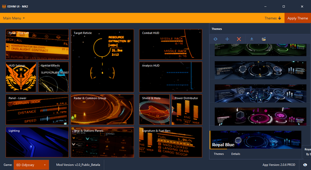

# EDHM_UI

User Interface for Elite Dangerous HUD Mod (EDHM)

## What is EDHM_UI?

EDHM_UI is the user interface for the Elite Dangerous mod [EDHM](https://github.com/psychicEgg/EDHM) by @psychicEgg.

Current features include:

* Allowing the user to change all of the mods current options using a simple graphical interface.
* Bundled with the latest EDHM version - no need to install EDHM separately.
* Bundled with lots of pre-made, community-contributed themes.
* Fully compatible with both Horizons and Odyssey!

## Requirements

EDHM_UI requires Microsoft .NET Framework version 4.52 or newer. If you are on Windows
10, you may already have it. If you don't have it installed yet, you can get it [here](https://dotnet.microsoft.com/download/dotnet-framework/net452).

## Installing EDHM_UI

* Download the latest release from the [releases page](https://github.com/BlueMystical/EDHM_UI/releases).
* Run the installer.
* Profit!

## Further reading

* [EDHM_UI Wiki](https://github.com/BlueMystical/EDHM_UI/wiki)
* [EDHM (GitHub)](https://github.com/psychicEgg/EDHM)
* [EDHM (Reddit)](https://www.reddit.com/r/EliteDangerous/comments/iu4mbj/elite_dangerous_hud_mod_edhm_custom_huds_without/)

## Support

If you have questions, suggestions, or comments, [join our Discord](https://discord.gg/ZaRt6bCXvj)!
