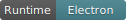
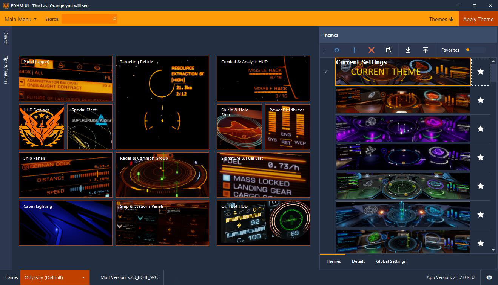

# EDHM_UI

User Interface for Elite Dangerous HUD Mod (EDHM)

## What is EDHM_UI?

EDHM_UI is the user interface for the Elite Dangerous mod [EDHM](https://github.com/psychicEgg/EDHM).
EDHM lets players customize their HUD colors and other graphical elements. It does not change game mechanics or paid game content.

Current features include:

* Allowing the user to change all of the mods current options using a simple
  graphical interface.
* Bundled with the latest EDHM version - no need to install EDHM separately.
* Bundled with lots of pre-made, community-contributed themes.
* Compatible with both Horizons and Odyssey.
* Translated to 6 languages: EN, RU, DE, FR, IT, PT.

## Requirements

EDHM_UI v3 is an Electron application for Windows x64 and Linux x64. Elite Dangerous and the EDHM core mod are required to see themes in game.

Linux users running Elite Dangerous through Proton or Wine should read [Linux Users](Linux%20Users.md) before installing or building the application.

## Installation

### Windows

* Download `edhm-ui-v3-windows-x64.exe` from the [latest release](https://github.com/BlueMystical/EDHM_UI/releases/latest).
* Run the installer and follow the on-screen prompts.
* Launch EDHM_UI from the desktop shortcut.

### Linux

See [Linux Users](Linux%20Users.md) for installation, building from source, Proton/Wine paths, system-keyring requirements, and Frontier account authorization.

## First-Run Setup

The first time EDHM_UI runs, it will prompt you for the Elite Dangerous game folder. This determines where the EDHM core mod will be installed. The location varies depending on the selected game installation. Follow the setup assistant to select the correct folder.

## Further reading

* [EDHM Website](https://bluemystical.github.io/edhm-api/)
* [EDHM (GitHub)](https://github.com/psychicEgg/EDHM)
* [EDHM (Reddit)](https://www.reddit.com/r/EliteDangerous/comments/iu4mbj/elite_dangerous_hud_mod_edhm_custom_huds_without/)
* [Linux installation, build, and Frontier authorization](Linux%20Users.md)

## Support

If you have questions, suggestions, or comments, [join our Discord](https://discord.gg/ZaRt6bCXvj)!

